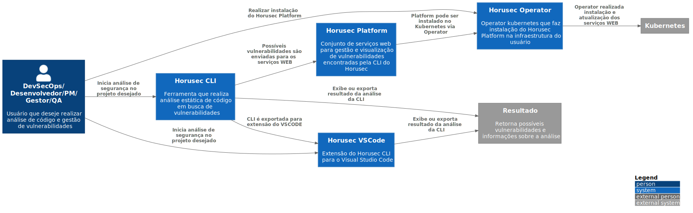

# C1 - Context

No primeiro nível podemos ver de forma superficial como é a ligação entre em os diferentes componentes do Horusec e um pouco sobre suas responsabilidades.

Nesse nível contextualizamos de forma macro como o Horusec entrega o resultado de suas análises e permite que o usuário possa gerenciar as vulnerabildades na plataforma web. Onde:

Usuário: Qualquer pessoa que deseje realizar análise de código e gestão de vulnerabilidades pelo Horusec. Seja ela um DevSecOps, Desenvolvedor, PM, Gestor, QA, etc.

Sistema Horusec-CLI: A Horusec-CLI é uma interface de linha de comando (CLI) que orquestra outras ferramentas de análise estática de código. Sua principal funcionalidade é identificar as linguagens de programação do projeto automaticamente e iniciar as devidas ferramentas, logo em seguida poderá ser exportada as informações unificadas em um dado em comum. Também é possível enviar a análise realizada para o sistema Horusec-Platform onde poderá retirar de metricas e realizar a gestão de vulnerabilidades em uma aplicação web.

Sistema Horusec-Platform: A Horusec-Platform é um conjunto de serviços web para gestão e visualização de vulnerabilidades encontradas pelo sistema Horusec-CLI.

Sistema Horusec-Operator: O Horusec-Operator é um sistema de kuberntes operators que agiliza e potencializa a instação do sistema Horusec-Platform de forma unificada.

Sistema Horusec-VsCode: O Horusec-VsCode é uma extenção da Horusec-CLI para um Ambiente de Desenvolvimento Integrado (IDE) [Visual Studio Code](https://code.visualstudio.com/) onde pode realizar as análises sem necessitar de instalar um binário em sua máquina local.

Kubernetes: Orquestra os containers das aplicações.

Resultado: Resultado das análises realizadas pelos sistemas Horusec-CLI ou Horusec-VsCode.

