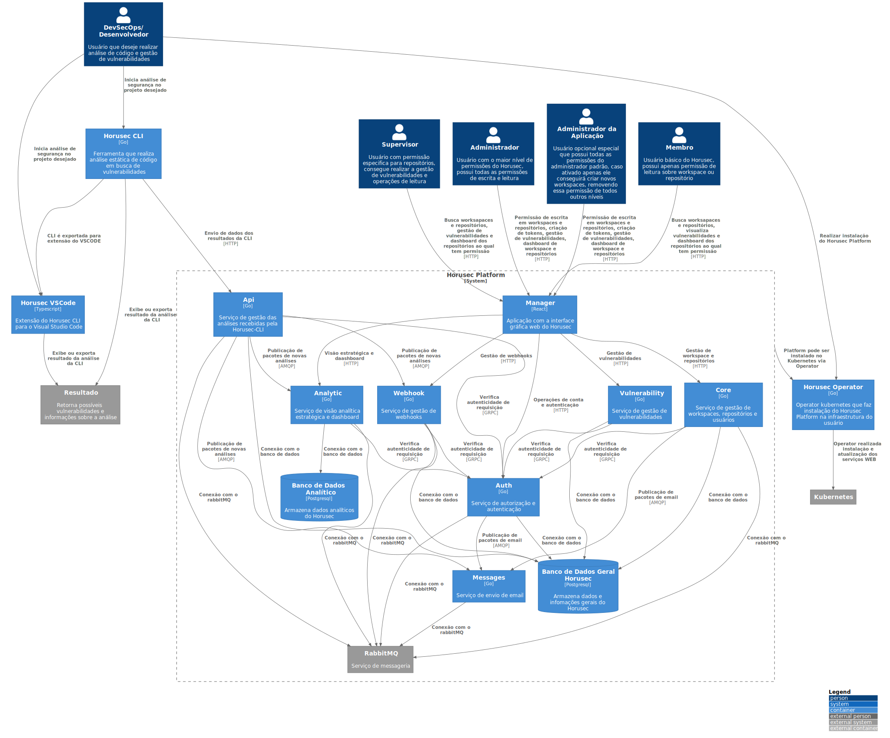

# C2 - Container

`/C2 - Container`

* [C4Model](/docs/README.md)
  * [C1 - Context](/docs/C1%20-%20Context/README.md)
  * [**C2 - Container**](/docs/C2%20-%20Container/README.md)
  * [C3 - Component](/docs/C3%20-%20Component/README.md)
    * [CLI](/docs/C3%20-%20Component/CLI/README.md)
    * [Operator](/docs/C3%20-%20Component/Operator/README.md)
    * [Platform](/docs/C3%20-%20Component/Platform/README.md)
    * [VScode](/docs/C3%20-%20Component/VScode/README.md)

---

[C4Model (up)](/docs/README.md)

---

No segundo nível podemos verificar de forma mais detalhada como é interligada a arquitetura do Horusec e seus componentes, como também as tecnologias que fazem parte desse ecossistema.

