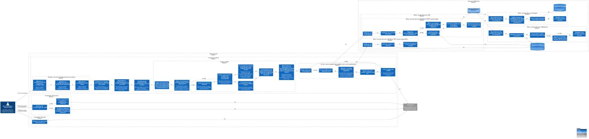

# CLI

A CLI (sigla para interface de linha de comando) é o programa responsável por processar comandos de um software ou qualquer programa computacional por meio de texto. No contexto da ferramenta, o Horusec-CLI é a parte de código que permite você rodar os comandos de análise de segurança e de identificação e/ou classificação de vulnerabilidades.

