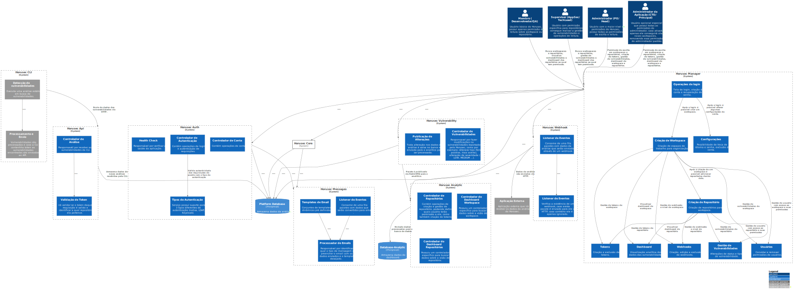

# Platform

A aplicação web do Horusec (horusec-platform) é uma extensão das funcionalidades da CLI. Na aplicação é possível realizar a organização em repositórios e workspaces para facilitar a visualização das vulnerabilidades em forma de gráficos e também classifica-las da forma que convém a equipe.

