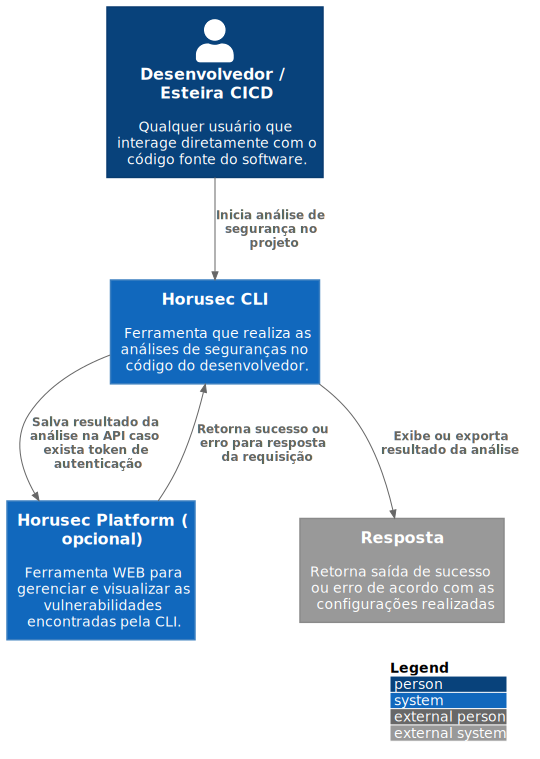

# c1

# C4Model Horusec-CLI - C1

## Description

With the Horusec CLI, the developer or the CI wake itself can perform a statistical code analysis looking for likely vulnerabilities. After the analysis, the result is displayed by the CLI and can also be sent to Horusec's web services for vulnerability management, remembering that the cli does not depend on the web services and can be used independently.
