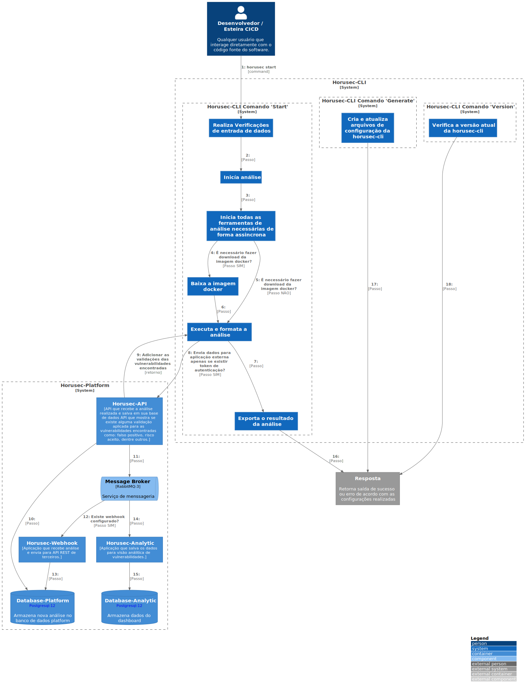

# c2

# C4Model Horusec-CLI - C2

## Description

Once the CLI is triggered, some configuration and dependency validations will be performed. If everything is correct, Horusec will start to identify languages ​​contained in the execution site and download their respective Docker images containing the analysis tools, remembering that only third-party open source tools are contained in the images, Horusec's own engine does not depends on the Docker. After the execution of the containers, the result of each one will be formatted to a standard and presented to the user, which can also be sent to Horusec's web services for vulnerability management and strategic vision.
