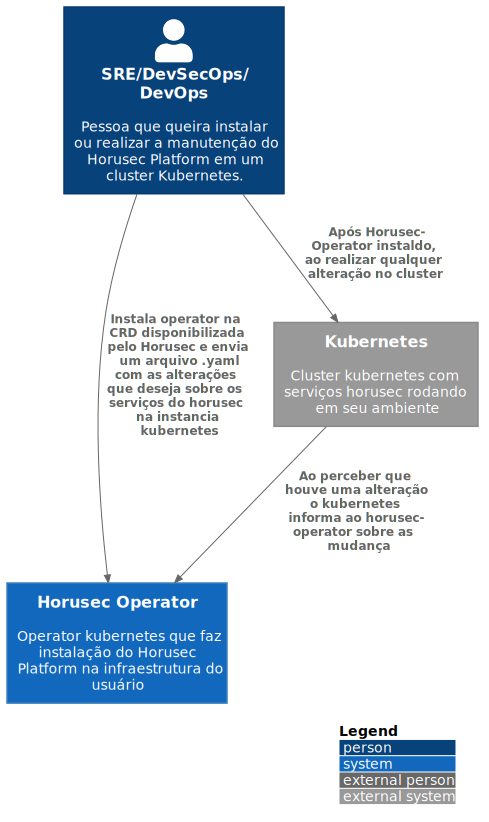

# c1

# C4Model Horusec-Operator - C1

## Description
If the user wants to install Horusec WEB in a Kubernetes cluster, the best option is the Horusec Operator.
It refers to a custom resource that will perform all the installation and configuration of the platform.