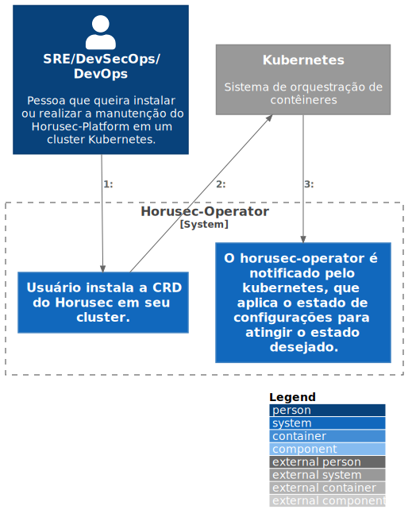

# c2

# C4Model Horusec-Operator - C2

## Description
To install the operator, it is necessary to add the custom resource (CRD) of Horusec in the Cluster.
After installation it will be possible to edit all Horusec settings through the CRD, where any change will notify Kubernetes and will update all WEB services.