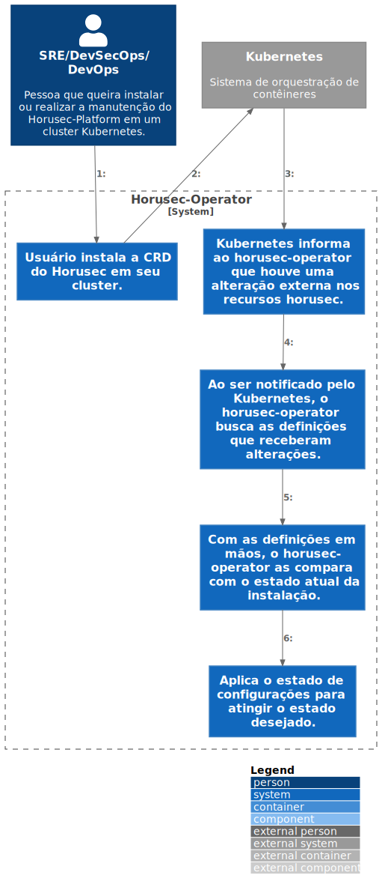

# c3

# C4Model Horusec-Operator - C3

## Description
This step-by-step happens when verifying that changes were made in the Horusec resource, where Kubernetes will notify the operator. Once notified, the operator looks for the new settings and compares them with the current state of the installation and applies the desired state, ie the new settings to services, deployments and so on. Thus saving all the work of the user having to make modifications to all these features of Kubernetes.
