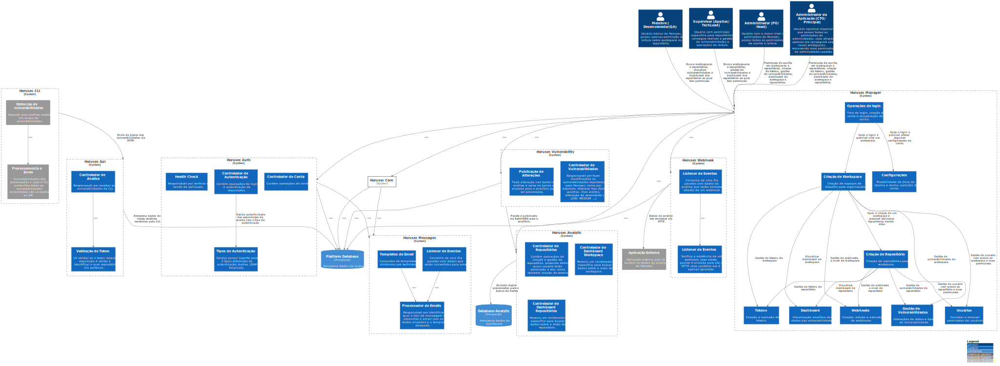

# c3

# C4Model Horusec-Platform - C3

## Description
Then you can expand and decompose each container to identify the main structural building blocks and your interactions.

The component diagram shows how a container is composed of a number of "components", which each of these components is, their responsibilities and details of technology / implementation.