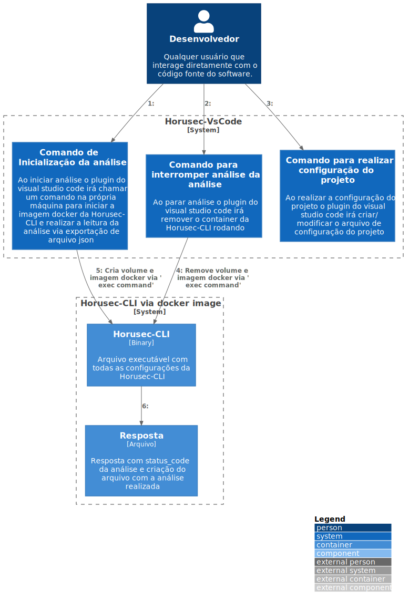

# c2

# C4Model Horusec-VsCode - C2

## Description

The horusec-vscode extension has three main commands: Start, Stop and Config.

When activated, or Start command, create a horusec-cli image through Docker to read, verify two files and export two results in JSON format for or vs-code. No final analysis or container removed.

During the execution of an analysis, the user also has the option to cancel, through the Stop command. This remove or container command gives horusec-cli em execução.

And by last, we have the Config command, this opens a selection box for any of the options of configuration of the horusec-cli and logo, then select one of them, and open a box of digitação for the value referring to the selected option. These configurations will be reviewed for the image in docker for future analysis runs.
