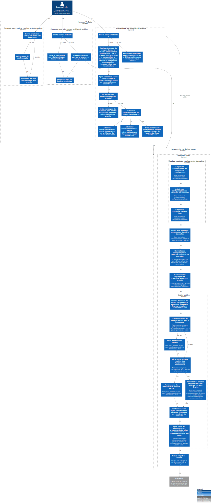

# c3

# C4Model Horusec-VsCode - C3

## Description

I have installed extension, no editor, vs-code, or user in your disposition, the main functionalities of horusec-cli through vs = code.

Before starting an analysis, you can access the configuration of the horusec-cli through the option "Settings" in the interface of the extension. To operate this command, it will display a list of seleção das configurações da horusec-cli, then select one of them, and display a text box to inform or reference value. These configurations will be written in the horusec-cli configuration file, then in addition to defining the configuration and verified if the horusec-cli configuration file exists within the source code that is open. If it does not exist, it created a file named "horusec-config.json" at the root of the project in questão. If there is an apos ter logo created or file, or value of the configuration and written in this file.

Ao start an analysis, or first step to verify that there is an analysis in execution, it is houver, or the user will be informed to wait for the analysis in execution to finish to start a new. If you do not have an analysis in execution, it has been carried out or downloaded from the imagem docker from horusec-cli and a volume docker to share the information between the container and the extension vs-code. At the end of the analysis, the extension face to read the result in a JSON file not volume docker created previously, it contains the vulnerabilities found, not source code. It displays a message no vs-code informing or analyzing the quantity of vulnerabilities found. As reported vulnerabilities, to extent localize or stretch of vulnerável code or sinaliza.

Or the user has an option to stop an analysis through the "Stop" command. To be activated, this command verifies whether an analysis is actually running, it is not houver, and a message is displayed informed that there is not an analysis being rolled at the time. If you clicked or "Stop" command and actually houver a rolled analysis, and executed or command to stop and remove or container da horusec-cli.