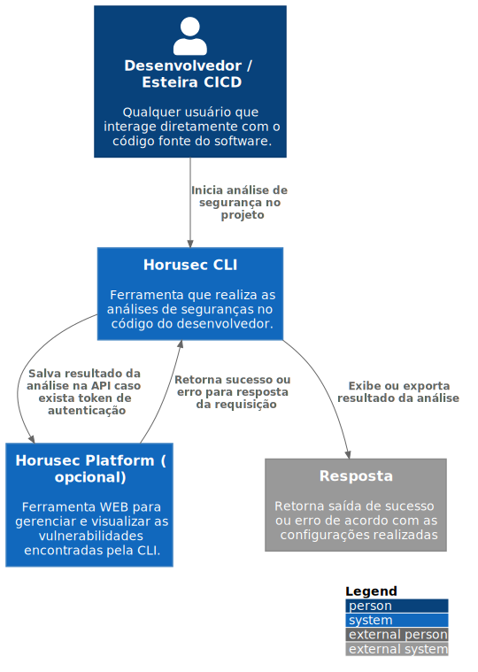

# c1

# C4Model Horusec-CLI - C1

## Descrição

Com a CLI do Horusec, o desenvolvedor ou a própria esteira de CI podem executar uma análise estatística de código em busca de prováveis vulnerabilidades. Após a análise, o resultado é exibido pela CLI e pode também ser enviado para os serviços web do Horusec para gestão de vulnerabilidades, lembrando que a cli não depende dos serviços web e pode ser utilizada de forma independente.