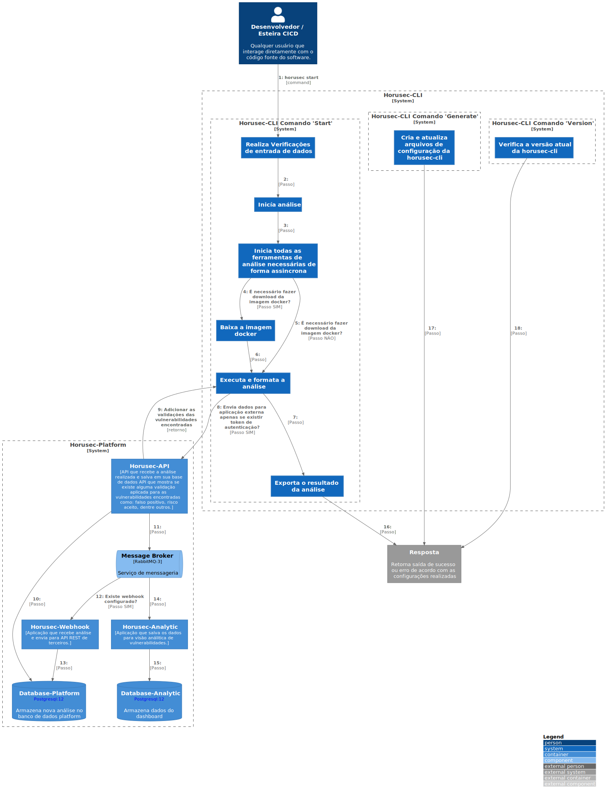

# c2

# C4Model Horusec-CLI - C2

## Descrição

Assim que a CLI for acionada, algumas validações de configurações e dependências serão executadas. Caso tudo esteja de forma correta, o Horusec irá começar a identificar linguagens contidas no local de execução e baixar suas respectivas imagens Docker contendo as ferramentas de análise, lembrando que apenas ferramentas open source de terceiros estão contidas nas imagens, o motor próprio do Horusec não depende do Docker. Após a execução dos containers, o resultado de cada um será formatado para um padrão e apresentado ao usuário, sendo que esse pode ser também enviado aos serviços web do Horusec para gestão de vulnerabilidades e visão estratégica.

Também existem outros dois comandos além do principal para início de análise, sendo eles o comando de versão da CLI instalada e o de geração de arquivo de configuração da CLI, o qual irá gerar um exemplo de configuração com valores padrões.