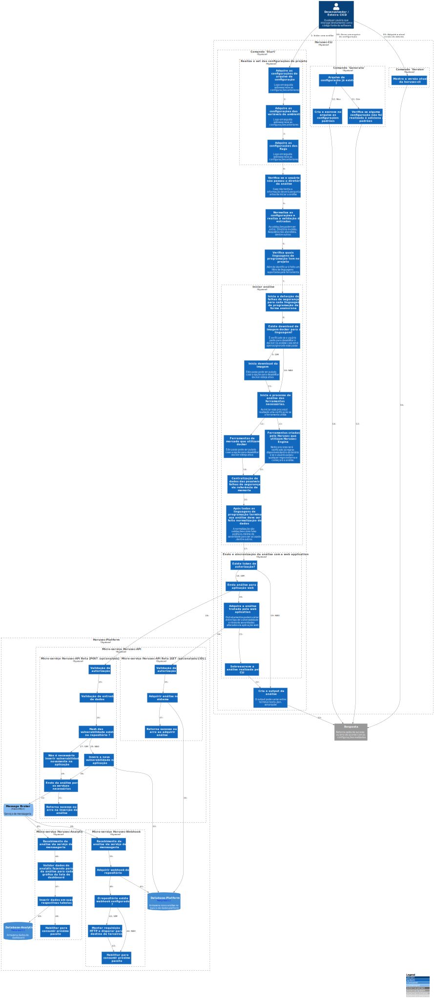

# c3

# C4Model Horusec-CLI - C3

## Descrição

Descendo a um nível mais baixo do passo a passo da execução, assim que o comando start é executado, a CLI irá preencher a sua configuração através de três fontes, sendo que elas possuem uma prioridade na seguinte ordem, arquivo de configuração, variáveis de ambiente e por fim flags, dessa forma uma configuração passada por arquivo será sobreposta por uma de variável de ambiente e assim por diante. Ao adquirir todas as configurações, ocorrerá uma validação tanto para os valores informados a CLI como também das dependências necessárias ao Horusec.

O próximo passo é a duplicação do projeto, onde ele será copiado para uma pasta chamada .horusec, dessa forma evitando alterações indesejadas das ferramentas ao código original, nesse processo também é feita a exclusão de arquivos que não devem ser considerados na análise, como por exemplo imagens, node_modules, arquivos de IDE e também arquivos informados pelo usuário nas configurações. Com o projeto copiado, a CLI irá verificar todas as linguagens que o repositório possuí para começar a próxíma etapa.

Agora para cada linguagem identificada será feito o download de uma imagem Docker, isso caso não exista localmente. Cada uma delas possuíndo as ferramentas open source de terceiros instaladas, dessa forma não é necessário nada além do Horusec e Docker na máquina que está rodando a CLI, lembrando que caso a opção de autor de commit esteja ativa, o Git também se torna uma dependência. Com as imagens baixadas, iremos executar um container de linguagem para cada ferramenta, dentro dele será feita toda a análise, e ao finalizar teremos o resultado com as prováveis vulnerabilidades. O Horusec possui também seu próprio motor de análise, que não depende de Docker e caso o usuário deseje, pode executar apenas o motor próprio da CLI, assim ignorando a dependência do Docker.

Assim que um container retorna o resultado, ele é formatado para o padrão do Horusec e armazenado na CLI até todos serem finalizados. Após isso, começa a exibição das possíveis vulnerabilidades encontradas, onde todas são apresentadas no mesmo formato e com várias informações uteis para validar e encontrar o erro apontado. Além de mostrar o resultado no terminal, é possível exportar para json , txt e sonarqube, como também enviar para os serviços web do Horusec, sendo que essa parte é totalmente opcional e a CLI atua de forma totalmente independente.

Para enviar uma análise é necessário informar um token de autorização para a CLI, esse será enviado ao serviço WEB Horusec API, que após validar a autenticidade desse token e a qual workspace e repositório aquela nova análise pertence, irá salvar no banco de dados centralizado. Irá também ocorrer a publicação em uma fila AMQP, esse pacote é enviado para o serviço WEB analítico que como o API vai processar e salvar os dados da nova análise.

Também existem outros dois comandos além do principal para início de análise, sendo eles o comando de versão da CLI instalada e o de geração de arquivo de configuração da CLI, o qual irá gerar um exemplo de configuração com valores padrões.
