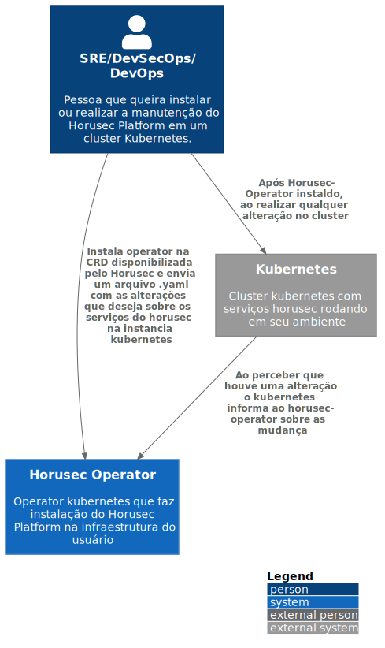

# c1

# C4Model Horusec-Operator - C1

## Descrição
Caso um usuário deseje realizar a instalação do Horusec WEB em um cluster Kubernetes, a melhor opção é o Operator do Horusec.
Ele se refere a um recurso personalizado que irá realizar toda instalação e configuração do platform.
