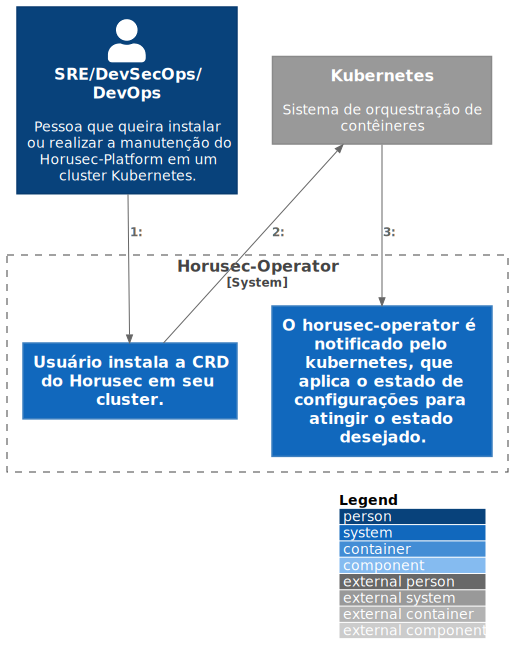

# c2

# C4Model Horusec-Operator - C2

## Descrição
Para realizar a instalação do operator, é necessário adicionar o recurso personalizado (CRD) do Horusec no Cluster. 
Após a instalação será possível editar todas as configurações do Horusec através do CRD, onde qualquer alteração notificará o Kubernetes e irá atualizar todos os serviços WEB.
