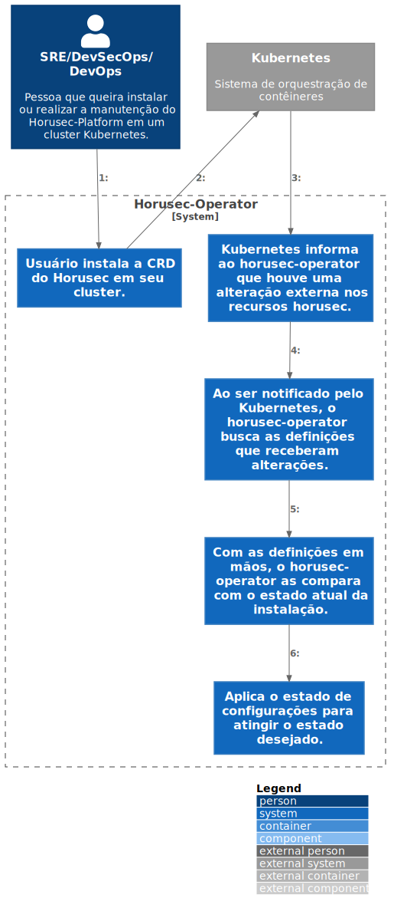

# c3

# C4Model Horusec-Operator - C3

## Descrição
Descendo em num nível mais abaixo e explicando como o Kubernetes trabalha com o CRD do Horusec, vamos verificar como é o comportamento após a instalação da CRD e a sequencia de passos que irá ocorrer.
Esse passo a passo acontece ao verificar que foram relizadas alterações no recurso do Horusec, onde Kubernetes irá notificar o operator. Assim que notificado o operator busca as novas configurações e as compara com o estado atual da instalação e aplica o estado desejado, ou seja as novas configurações aos services, deployments e assim por diante. Dessa maneira poupando todo o trabalho do usuário ter que fazer modificações em todos esses recursos do Kubernetes.