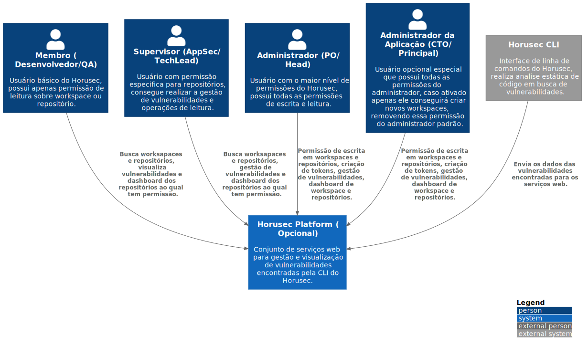

# c1

# C4Model Horusec-Platform - C1

## Descrição
Um diagrama de contexto do sistema é um bom ponto de partida para diagramação e documentar um sistema de software, permitindo que você recue e veja a grande figura.Desenhe um diagrama mostrando seu sistema como uma caixa no centro, cercado por seus usuários e os outros sistemas que interage.

O detalhe não é importante aqui, pois esta é a sua opinião ampliada mostrando uma grande imagem da paisagem do sistema.O foco deve estar em pessoas (atores, papéis, personas, etc) e sistemas de software, em vez de tecnologias, protocolos e outros detalhes de baixo nível.É o tipo de diagrama que você poderia mostrar para pessoas não técnicas.