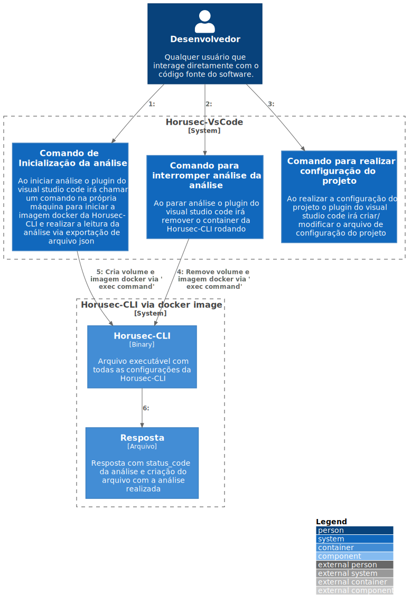

# c2

# C4Model Horusec-VsCode - C2

## Descrição

A extensão horusec-vscode possuí três comandos principais: Start, Stop e Config.

Quando acionado, o comando Start, cria uma imagem da horusec-cli através do Docker para realizar a leitura, verificação dos arquivos e a exportação dos resultados em formato JSON de volta para o vs-code. No fim da análise o container é removido.

Durante a execução de uma análise, o usuário também tem a opção de cancelar, através do comando Stop. Este comando remove o container da horusec-cli em execução.

E por fim, temos o comando de Config, este abre uma caixa de seleção para uma das opções de configurações da horusec-cli e logo após selecionar uma delas, é aberta uma caixa de digitação para o valor referente a opção selecionada. Essas configurações serão repassadas para a imagem em docker da horusec-cli nas próximas execuções de análises.
